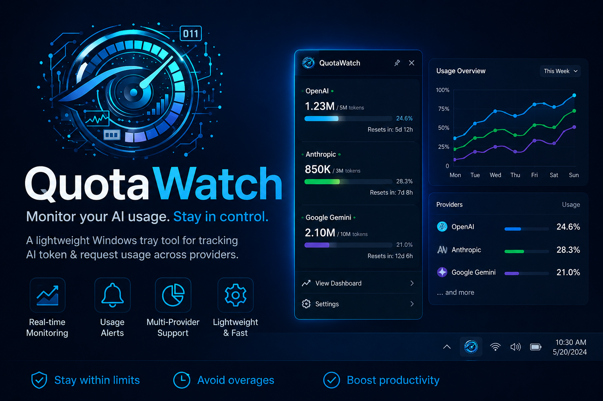

# QuotaWatch



[](https://github.com/ChickenLoner/quota-watch/releases/latest)
[](https://github.com/ChickenLoner/quota-watch/releases)
[](https://github.com/ChickenLoner/quota-watch/releases/latest)
[](https://developer.microsoft.com/en-us/microsoft-edge/webview2/)
[](LICENSE)

Monitor AI token and quota usage across multiple providers from a lightweight Windows system tray app. Supports Claude, OpenAI Codex, Windsurf, and Google Antigravity with real-time polling, threshold alerts, and a keyboard-driven popup UI.

Inspired by [CodexBar](https://github.com/steipete/CodexBar) and [usage-monitor-for-claude](https://github.com/jens-duttke/usage-monitor-for-claude). UI styled after a Security Operations Center console: dark navy, cyan/amber/red severity indicators, hex grid backdrop.

---

## Features

- **Multi-provider** - Claude, OpenAI Codex, Windsurf, Antigravity; tabs switch between them in the popup
- **Per-provider account info** - email and plan shown per active tab
- **Focus / Grid layouts** - Focus mode for single-provider detail; Grid mode for all providers at a glance (with compact density toggle)
- **Animated transitions** - smooth crossfade + staggered card entrance when switching between Focus ↔ Grid and compact ↔ expanded
- **Tray tooltip** - hover the tray icon to see per-provider utilization and reset countdowns at a glance
- **Severity badges** - NOMINAL / WARNING / CRITICAL / BREACH on each bar
- **Provider logos** - real Claude / Codex / Antigravity icons in tabs and dropdown, not plain dots
- **Grid sorted by health** - healthiest provider listed first, so you know where to switch
- **Smart alerts** - tray notifications at 50%, 80%, 95% session; 95% weekly; each threshold fires once per window and re-arms on reset
- **Reset detection** - notifies when quota resets after near-exhaustion
- **Adaptive polling** - 3-min normally, 30s when session usage is rising
- **Extra usage** - Claude credit balance if enabled
- **CLI version discovery** - Claude Code (CLI + IDE extensions), Codex CLI, Antigravity CLI
- **Changelog links** - jump straight to release notes for the active provider's CLI
- **Global hotkeys** - `Ctrl+Shift+Q` opens the popup, `Ctrl+Shift+R` restarts, `Ctrl+Shift+X` quits, from anywhere
- **Full keyboard navigation** - `←`/`→` Focus ↔ Grid, `↑`/`↓` switch provider (Focus) or scroll (Grid), `R` refresh, `T` theme, `C` compact density, `Esc` close; works with any keyboard layout (Thai, CJK, etc.)
- **Instant keyboard focus** - popup accepts keystrokes immediately on open, no click required
- **Start with Windows** - registry autostart (frozen EXE only)
- **No console window** - silent background tray process

---

## Providers

| Provider | Auth source | Fields tracked |
|---|---|---|
| **Claude** | `~/.claude/.credentials.json` | SESSION 5H, WEEKLY 7D, plan fields |
| **OpenAI Codex** | `~/.codex/auth.json` or `OPENAI_API_KEY` | SESSION (1H/3H/5H), DAILY, WEEKLY 7D, MONTHLY 30D |
| **Windsurf** | Local SQLite `state.vscdb` (no login needed) | DAILY 1D, WEEKLY 7D |
| **Google Antigravity** | Windows Credential Manager `gemini:antigravity` (OAuth) | CLAUDE, GEMINI PRO, GEMINI FLASH, GPT-OSS (quota groups) |

New quota fields from the Claude API appear automatically - no code changes needed.

> **Antigravity** is the successor to the now-retired Gemini CLI. It exposes ~20 model IDs that share quota per model family, so QuotaWatch collapses them into 4 quota **groups** (see [How it works](#how-it-works)).

---

## Platform coverage

| Platform | Implementation |
|---|---|
| Windows 10+ | System tray app - Python + WebView2 [`monitor/`](monitor/) |
| Linux / Kali | Statusline + TUI dashboard - Python + rich [`linux/`](linux/) |

---

## Requirements

### Windows
- Windows 10 or later
- [Claude Code](https://docs.anthropic.com/en/docs/claude-code) installed and authenticated (`claude auth login`)
- [Microsoft Edge WebView2 Runtime](https://developer.microsoft.com/en-us/microsoft-edge/webview2/) - pre-installed on Windows 11, download separately for Windows 10

### Linux
- Python 3.10+, `pip install requests rich`
- Claude Code installed and authenticated (`claude login`)

See [`linux/README.md`](linux/README.md) for details.

---

## Usage

### Pre-built EXE

Download `QuotaWatch.exe` from [Releases](../../releases) and run. No installation needed.

> **Blocked by Smart App Control?** The EXE is not code-signed yet, so Windows 11's Smart App Control (SAC) blocks it as an unknown app. SAC has no "Run anyway" button and no per-app allowlist, so you have to turn it off to run an unsigned app you trust:
>
> 1. Open **Windows Security** → **App & browser control** → under *Smart App Control*, click **Smart App Control settings**
> 2. Switch **Smart App Control** to **Off**
> 3. Run `QuotaWatch.exe`
>
> Recent Windows 11 builds let you turn SAC back **On** afterward; older builds require a Windows reset to re-enable it. Prefer not to touch SAC? Run [from source](#from-source) instead — `python.exe` is already trusted, so SAC allows it (you only lose the "Start with Windows" menu item, which is EXE-only).

### From source

```powershell
git clone https://github.com/ChickenLoner/quota-watch
cd quota-watch
uv sync
uv run python -m monitor
```

Requires [uv](https://docs.astral.sh/uv/) and Python 3.11+.

---

## Build EXE

```powershell
uv run pyinstaller quota_watch.spec --noconfirm
# Output: dist\QuotaWatch.exe  (~16 MB, single file)
```

---

## Project structure

```
monitor/
  __main__.py        entry point - DPI setup, webview loop, restart
  app.py             tray icon, polling loop, alerts, status cache
  tray.py            static app icon, theme watcher
  popup.py           pywebview popup window, payload builder, focus management
  formatting.py      time/countdown formatters
  autostart.py       Windows registry autostart
  claude_cli.py      Claude CLI/extension version discovery
  html/
    popup.html       popup markup
    popup.css        SOC console theme
    popup.js         provider switching, bar rendering, live countdowns
  providers/
    base.py          Provider ABC, QuotaField, UsageSnapshot dataclasses
    claude.py        Claude OAuth - api.anthropic.com/api/oauth/usage
    codex.py         Codex OAuth - chatgpt.com/backend-api/wham/usage
    windsurf.py      local SQLite state.vscdb (no network)
    antigravity.py   Antigravity OAuth - cloudcode-pa.googleapis.com (quota groups)
linux/               Linux/Kali statusline + TUI implementation
```

---

## How it works

Each provider reads its own auth token locally and polls its quota endpoint. Claude reads `~/.claude/.credentials.json`; Codex reads `~/.codex/auth.json`; Windsurf reads a local SQLite DB with no network call. Antigravity reads the access token that the `agy` CLI stores in the Windows Credential Manager entry `gemini:antigravity`. Credentials are used only in `Authorization` headers - never logged or stored elsewhere.

QuotaWatch does **not** refresh the Antigravity token itself (that would require Antigravity's OAuth client secret). The `agy` CLI refreshes the token on its own background loop; if the token has gone stale, the Antigravity tab shows **TOKEN EXPIRED** until you open Antigravity once.

### Antigravity quota groups

The Antigravity API (`fetchAvailableModels`) returns ~20 model IDs, but they don't each have an independent quota - models in the same family draw from one shared pool (e.g. every Gemini Flash variant counts against the same Flash allowance). QuotaWatch collapses them into 4 **groups** by matching the model ID prefix:

| Group | Matches model IDs |
|---|---|
| **CLAUDE** | `claude-*` (Sonnet, Opus) |
| **GEMINI PRO** | `gemini-*pro*`, `gemini-2.5-pro` |
| **GEMINI FLASH** | `gemini-*flash*` (incl. flash-lite, flash-image) |
| **GPT-OSS** | `gpt-oss-*` |

Internal/unnamed models (`tab_*`, `chat_*`) are skipped. Within each group, the bar shows the **most-consumed** member (lowest remaining quota), so the bar reflects whichever model in that family you're closest to exhausting. The grouping logic lives in `monitor/providers/antigravity.py:_aggregate_groups`; adjust `_GROUPS` there if Google changes the model lineup.

---

## Security

- Reads local credential files, SQLite DBs, and the Windows Credential Manager (`gemini:antigravity`) only - no password prompt
- HTTPS endpoints used:
  - `api.anthropic.com` - Claude usage
  - `chatgpt.com` - Codex usage
  - `cloudcode-pa.googleapis.com` - Antigravity quota
- **No embedded secrets.** QuotaWatch never refreshes the Antigravity token itself, so it ships no OAuth client secret. It only reads the access token `agy` already stored locally. If you don't use Antigravity, the provider stays dormant - it activates only when `~/.gemini/antigravity-cli/` exists.
- No telemetry, analytics, or third-party services
- No `eval()`, `exec()`, dynamic imports, or obfuscated strings
- All source in this repo - audit before running

---

## License

MIT
